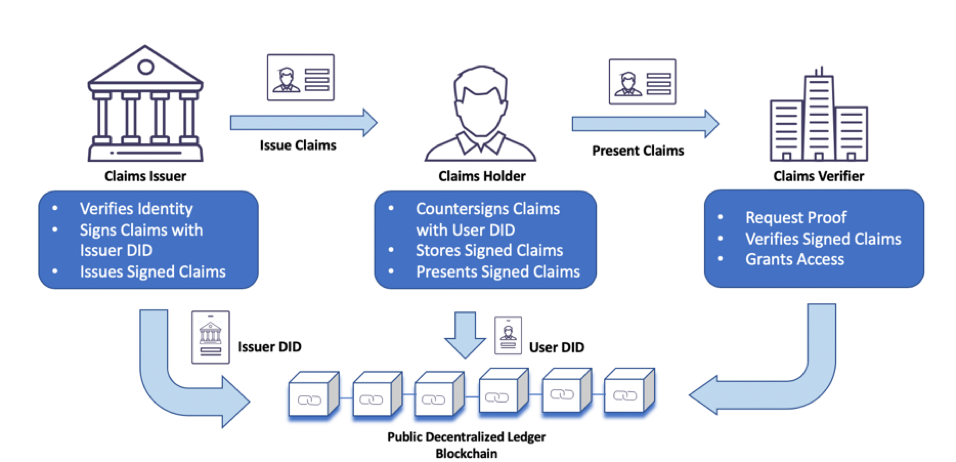

## OpenChainID

### Overview

### The Problem
Everyday we carry wallets full of cards
However, a select few like government IDs and credit cards are widely accepted. As our
society has established global norms for how we present and verify the credentials these
physical cards represent.But there is no equivalent for digital credentials.
Firstly, There is no standard mechanism to issue and own digital identity.
Our access to these identifiers and our personal information is at the mercy of service
providers.

There is no universally accepted standard for -
- Expressing
- Exchanging
- Verifying

Across organizational boundaries.
A new form of digital identity based on emerging standards such as verifiable credentials
and decentralized identifiers can enable such digital credentials to work everywhere. Be
more trustworthy and respect privacy.

### 